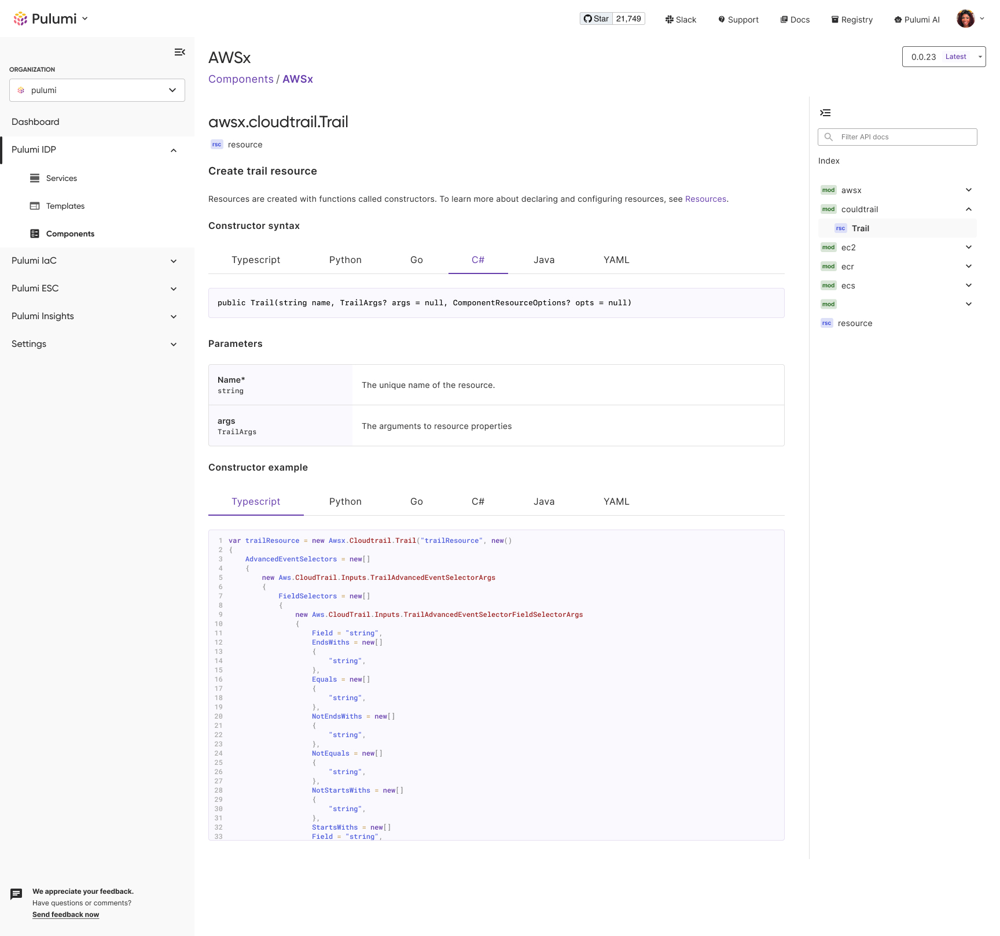
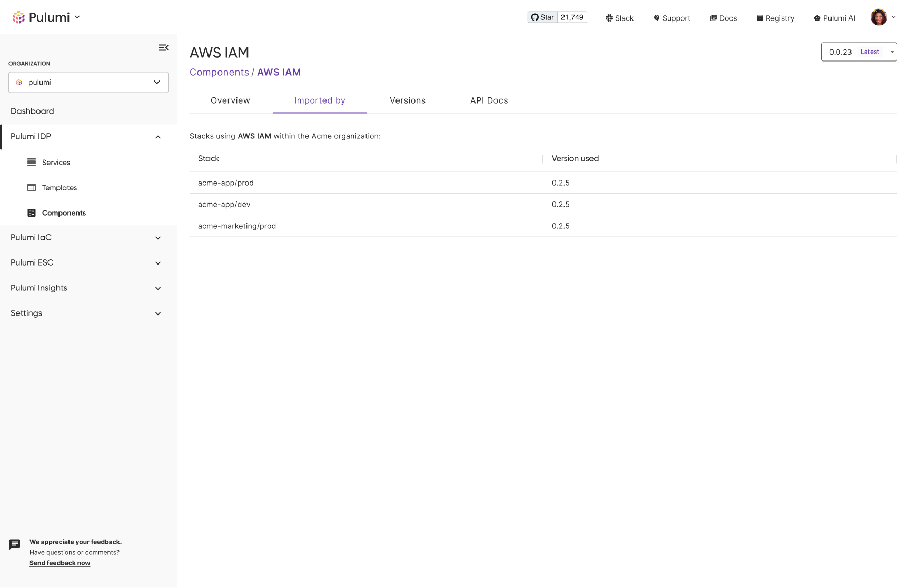

As part of the [Pulumi IDP](https://www.pulumi.com/product/internal-developer-platforms/) announcement at [PulumiUP](https://www.pulumi.com/pulumi-up/), we introduced the Pulumi Private Registry. For years, we’ve worked with organizations that have built their own internal developer platforms on top of Pulumi. During that time, we identified what we believe is the best method for creating flexible golden paths – a bottom-up approach that utilizes a central source of truth to drive golden paths. Thanks to Pulumi Private Registry, this approach has never been simpler.

<!--more-->

## Codified Security and Compliance

Platform teams use Pulumi's components and templates to standardize how resources and programs are shaped and provisioned. They use [Pulumi ESC](/docs/esc/) to automatically import secret dependencies and lease short-term credentials. They incorporate [Pulumi CrossGuard](/docs/iac/using-pulumi/crossguard/get-started/) policy as code to ensure that provisioned infrastructure remains compliant even when customized by developers. Publishing and consuming packages through the private registry guarantees platform teams can achieve the consistency, security, and compliance their business needs without sacrificing the flexibility their developers need.

## Streamlined Publishing

The CLI publishing workflow prioritizes ergonomics, making it easy to use. Publishing a package is as simple as running a single CLI command, ensuring seamless integration in local or automated workflows. It supports publishing packages from public or private git repositories, package versioning, multiple organizations, and custom `README` paths.

## Simplified Discovery

Once published, developers can discover standardized and compliant components and templates from a developer-friendly, centralized location – helping teams streamline infrastructure provisioning and avoid shadow workflows. Developers also get immediate context thanks to automatically generated API docs and `README`s.

## Free Day 2 Context

Day 2 operations – maintaining, extending, and decommissioning infrastructure – comprise the bulk of the infrastructure lifecycle effort. Yet these tasks often feel like flying blind. Pulumi IDP takes a bottom-up approach, driving building block publishing, discovery, and consumption through the Private Registry. This also provides usage insights out of the box, enabling platform engineers to see where components are used and which versions are in play, making it easier to plan upgrades and safely decommission outdated packages.

## Get Started Today

Pulumi IDP, including the Pulumi Private Registry, is now available in Public Preview for all users. [Sign up for a free account](https://app.pulumi.com/signup?utm_source=idp-private-registry) to get started, [learn more about Pulumi IDP](/docs/idp/get-started/), or [start publishing packages to your private registry](/docs/idp/get-started/private-registry/).
