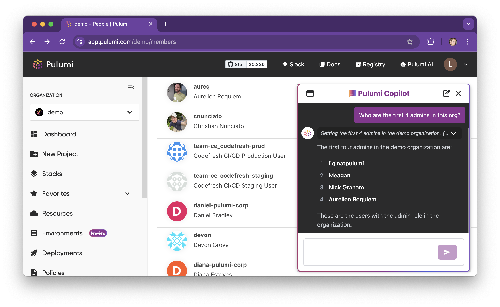
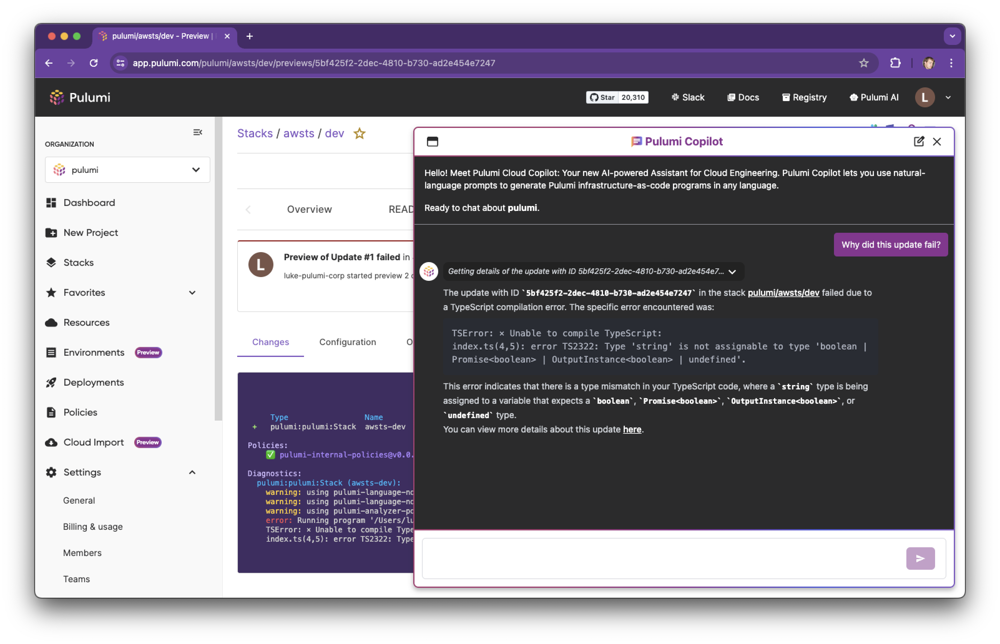
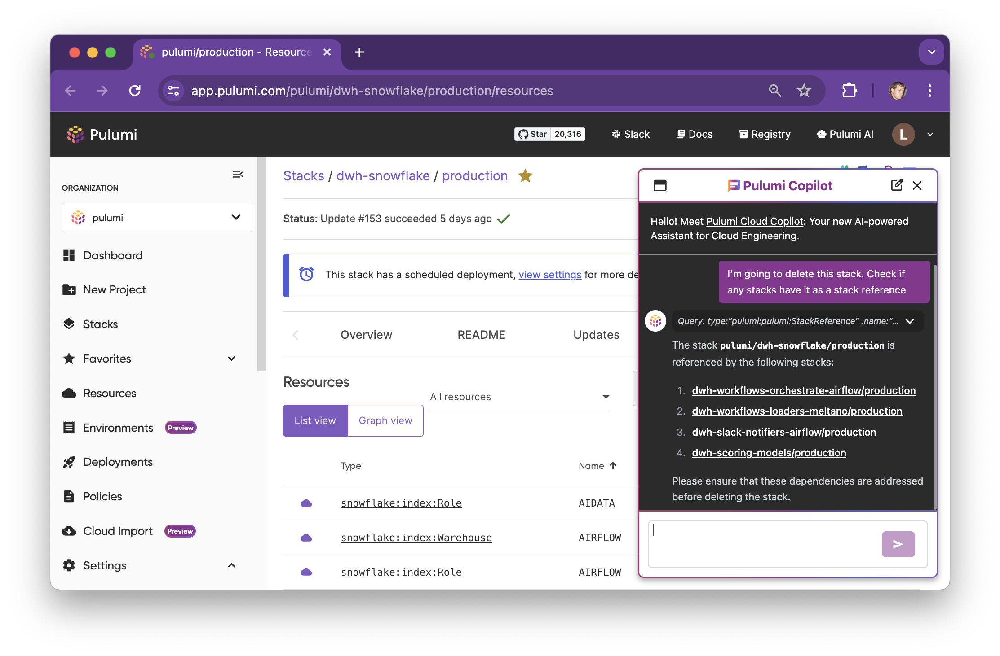
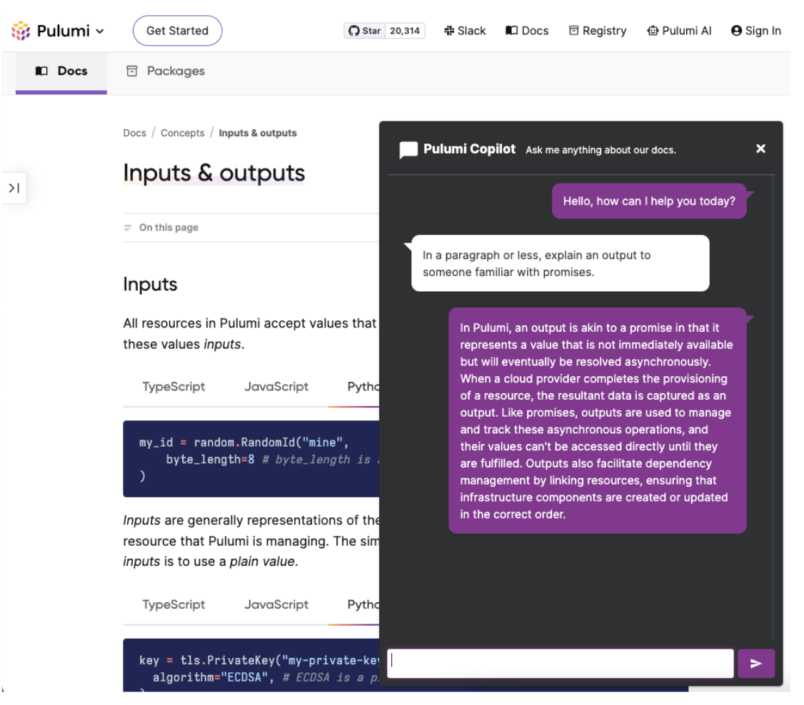

AI is transforming how users interact with every category of technology today, and cloud infrastructure is no exception.  Last year we launched Pulumi AI to combine generative AI with Pulumi’s knowledge of cloud infrastructure, helping users solve complex cloud development problems using Infrastructure-as-Code.  Pulumi AI has seen rapid adoption and engagement, with tens of thousands of users leveraging Pulumi AI over the last year.

Today, we’re excited to introduce __Pulumi Copilot__, a huge leap forward in applying AI to cloud infrastructure management.  Pulumi Copilot is a new conversational chat interface integrated throughout Pulumi Cloud, enabling Pulumi Cloud users to quickly accomplish a variety of cloud infrastructure management tasks by leveraging the power of large language models plus the rich capabilities of Pulumi Cloud.

<!--more-->



Through Pulumi Copilot, you can explore your cloud infrastructure and gain insights across an incredible breadth of use cases, including:

Pulumi Copilot enables these use cases via the following:

__Access any data in Pulumi Cloud__
  * The state of every resource you are managing with Pulumi across _any_ Cloud, _any_ account, and _any_ region.  With [Pulumi Insights'](https://www.pulumi.com/blog/pulumi-insights/) Cloud Supergraph support for 160+ cloud providers, this offers an unprecedented breadth of cloud infrastructure data to explore and interrogate with Pulumi Copilot.
  * Pulumi stacks, projects, updates, deployments, environments, policies, audit logs and more - enabling historical understanding of what happened when, by who, and why across all of your cloud engineering systems managed by Pulumi.

__Pulumi IaC Authoring and Deployment__
  * The same great Pulumi AI features for authoring IaC are now available inside Pulumi Copilot as well, enabling you to quickly solve new IaC problems within Pulumi Cloud, and even deploy code directly from Pulumi Copilot.

__Access cloud metadata from the clouds themselves__
  * Through the use of new skills, Pulumi Copilot can access cloud metadata in real time in AWS, Azure, Kubernetes, and more, allowing it to join Pulumi’s IaC world view with information about usage, costs, and more – as well as infrastructure not yet under the management of Pulumi.

Pulumi Copilot combines the best generative AI models available in the industry today with Pulumi Copilot “skills” which enable Pulumi Copilot to access the data and actions from within Pulumi Cloud needed to help you with your questions and explorations.  Pulumi Copilot also incorporates the context of where the user is in the Pulumi Cloud console to easily answer questions about “this stack”, or “the latest update”, offering an even more natural, conversational and persistent experience across Pulumi Cloud.

Pulumi Copilot is Enterprise-Ready on day one - it adheres to all the same identity and role based access control (RBAC) rules that exist across Pulumi Cloud, ensuring that users only have access to stacks, environments and resources that they have permissions for within Pulumi Cloud. This means that each organization gets AI generated responses based solely on their own organizational data.

Pulumi Copilot is available now in public beta, and is free while in beta for all organizations in Pulumi Cloud. Organization administrators can turn on Pulumi Copilot for their organization by going to __Settings > Access Management > Pulumi Copilot__ within the Pulumi Cloud console.

Try Pulumi Copilot now at [https://app.pulumi.com/](https://app.pulumi.com).



## Walkthrough of Pulumi Copilot

Let’s jump in and take Pulumi Copilot for a spin!

We can start off simple - it’s a conversational chat, so we can introduce ourselves. Pulumi Copilot knows who we are from context and we get a light hearted programming related joke.

Perhaps we need to gain access to additional infrastructure within Pulumi Cloud and need to contact an admin, we can ask who the admins are.

We get a hyperlink at the end, enabling us to jump directly to the members page, where we can see all of the details about the members and admins of the organization.  Pulumi Copilot helps to not just get information, but then navigate within the Pulumi Cloud console to continue to explore.

Pulumi Copilot has access to everything that Pulumi Cloud manages, including [Pulumi ESC](/docs/esc) environments. We can find all of the environments we have that manage access to GitHub through a natural language query, and then ask a follow up question to get a direct link to where each environment is defined.

If we do a Pulumi update, and it fails, we often get a complex error message, caused by some combination of a coding problem or a cloud provider configuration problem or a transient failure in cloud providers backing service.  We can use Pulumi Copilot to ask why an update failed, and get a plain language explanation, leveraging the AI’s existing knowledge of programming languages and cloud providers, combined with access to all of the update logs from within Pulumi Cloud. Notably, we can ask why “this” update failed, taking advantage of the context of the page we are on within Pulumi Cloud to understand which update we are referring to.

Perhaps we received an email from our compliance team telling us there was an issue with the VPC with id `vpc-04a116f7075fb7ca5`, but we have no idea where that is. Given we have hundreds of AWS accounts and dozens of regions in each of these accounts, finding this resource isn’t simple. We can just ask Pulumi Copilot, and it immediately tells us what AWS account it is in. We can follow this up with a question about which Pulumi project and stack is managing it, and get a link to go directly to the stack to learn more about how it is configured.

All of the capabilities of Pulumi AI for writing Pulumi IaC code are also available in Pulumi Copilot, so we can ask how to write a program for a new use case.  But we can also have Pulumi Copilot incorporate information from an existing stack, leveraging multiple Pulumi Copilot skills to help with this task.



If we are thinking about removing some infrastructure we may want to know what other infrastructure potentially depends on it.  We can get a list of stacks which depend on our stack, with hyperlinks directly to those stacks so we can explore their dependencies and take action to update them.

If we’re getting started on compliance with a new compliance framework, we can get guidance on areas to focus on for compliance review, ahead of applying more formal compliance tools like [Pulumi Crossguard Compliance Ready Policies](/docs/using-pulumi/crossguard/compliance-ready-policies/).

And we can get insights into what infrastructure is exposed to the internet which we may need to look deeper into with a quick question:

And our questions don’t have to be limited to English.  Early Spanish-speaking users have found themselves working with Pulumi Copilot in their native language, getting responses automatically in the same language of their question.

All of these examples are just scratching the surface of what Pulumi Copilot can already do today.  One of the most exciting things about conversational chat interfaces is their wonderfully wide surface area of potential applications - almost any question you might have related to Cloud Infrastructure managed within Pulumi Cloud is something Pulumi Copilot can help with!

## Future Directions

All of the examples above are things you can do today, but we’re not stopping there.  There’s a lot more coming up, and we wanted to give a sneak peek into some of the directions we’re taking Pulumi Copilot based on early customer feedback.

### Taking Action

In the initial Beta, Pulumi Copilot is restricted to get data and answer questions, but cannot take action directly, beyond guiding users to a place within the Pulumi Cloud console to take the action themselves.  In the near future, we will be extending Pulumi Copilot with the ability to propose actions and then act on them with user approval.

Check out [pulumi/cloud-requests#414](https://github.com/pulumi/pulumi-cloud-requests/issues/414) for more details.

### Pulumi CLI Integration

One of the most common requests we have gotten from early Pulumi Copilot users has been for integration into the Pulumi CLI where many users spend much of their time day-to-day.  We have started experimenting with CLI integration to help with diagnosing Pulumi update failures, and will be adding this to the CLI in the near future.

Check out [pulumi/cloud-requests#415](https://github.com/pulumi/pulumi-cloud-requests/issues/415) for more details.



### Pulumi Docs Website Integration

Pulumi Copilot is initially offered as part of Pulumi Cloud.  But we are working to extend Pulumi Copilot across the rest of pulumi.com, including integration with the Pulumi Docs website.  A new Pulumi Docs skill will allow Pulumi Copilot to help users learn Pulumi concepts and chat with Copilot about these to go deeper on concepts than what is already provided directly within the Pulumi Docs website.

Check out [pulumi/cloud-requests#417](https://github.com/pulumi/pulumi-cloud-requests/issues/417) for more details.

### Cloud CLI Skills

While Pulumi Copilot already has access to all the Cloud Infrastructure you are managing with Pulumi Cloud, there are many cases where it is useful to reach out to AWS directly to ask questions, get operational metrics, and take action.  We are already working on extending Pulumi Copilot with the ability to run aws and kubectl CLI commands, using short-lived credentials from one of your Pulumi ESC environments.  A sneak peek of that in action - showing how the AWS skill, combined with the ability to get details about resources and ESC environments from within Pulumi Cloud can enable collecting operational metrics from AWS and presenting them for analysis.

Check out [pulumi/cloud-requests#416](https://github.com/pulumi/pulumi-cloud-requests/issues/416) for more details.

# Conclusion

We’re excited to introduce Pulumi Copilot, the first conversational AI for general multi-cloud infrastructure management.  Pulumi Copilot is the next big step toward reimagining cloud infrastructure management via AI-based user experiences. We’re just getting started, with many improvements and new capabilities coming soon on top of the core Pulumi Copilot foundation. Pulumi Copilot is brand new and improving quickly in response to user feedback. If you have questions or suggestions:

* [Open an issue in GitHub](https://github.com/pulumi/pulumi-cloud-requests)
* [Reach out to schedule a demo](/contact/)
* [Join the Pulumi Community on Slack](https://slack.pulumi.com/)
* [Check out the Pulumi Copilot docs](/docs/pulumi-cloud/copilot)

Pulumi Copilot is available now in public beta, and is free while in beta for all organizations in Pulumi Cloud. Organization administrators can turn on Pulumi Copilot for their organization by going to __Settings > Access Management > Pulumi Copilot__ within the Pulumi Cloud console.

Get started with Pulumi Copilot in Pulumi Cloud today at [https://app.pulumi.com/](https://app.pulumi.com/).
